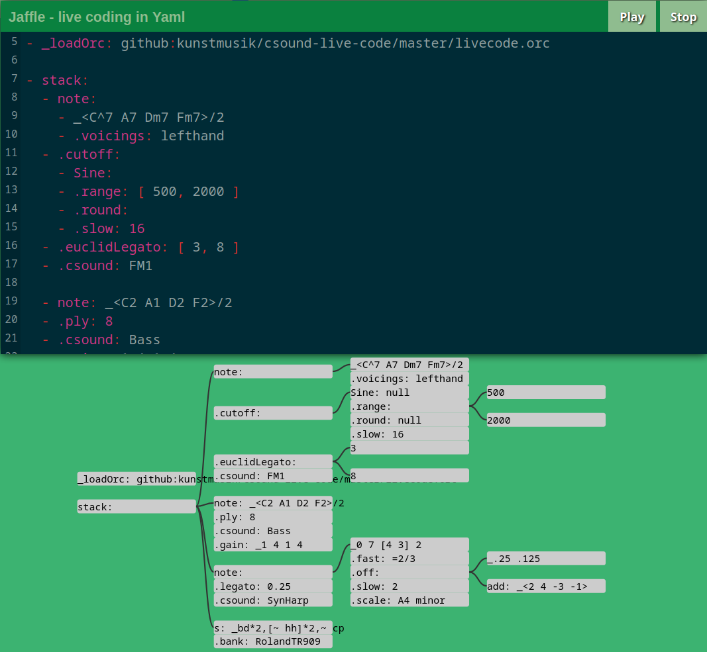

# Jaffle

**J**ust **a**nother **f**lat **f**ile **l**ivecoding **e**nvironment.

Check out the [demo website](https://roipoussiere.frama.io)!

## Introduction

Jaffle is an hybrid yaml/node editor for [Tidal-cycles](https://tidalcycles.org/), based on [Strudel](https://strudel.tidalcycles.org).

It aims to make algorithmic music more accessible for people who are not familiar with programming languages.

Under the hood, Jaffle is a transpiler generating JavaScript code, which is then interpreted by Strudel.

## Features

- tune visualization
- easy to read yaml syntax (albeit ususally a bit more verbose than Strudel, because less compact)
- use lambda functions, expressions, variable definitions, [and more](https://roipoussiere.frama.io/jaffle/syntax/)
- includes all Strudel examples converted into Jaffle syntax
- extensive [unit tests](tests/transpiler.test.ts)

## Roadmap

- make the graph editable and allow to switch between yaml and node editor
- improve node editor layout
- allow to import strudel tune
- create a desktop app
- code completion
- own documentation

## Syntax

Go to the [syntax section](https://roipoussiere.frama.io/jaffle/syntax) in the Jaffle website (or alternatively read [its source](./website/content/syntax.md) if necessary).

## Technical stack

Jaffle stands on the shoulders of giants:

- music code interpreter: [Strudel](https://strudel.tidalcycles.org/)
- graph renderer: [D3](https://d3js.org/)
- text editor: [CodeMirror](https://codemirror.net/)
- website generator: [Hugo](https://gohugo.io/)
- unit tests framework: [Jest](https://jestjs.io)
- linter: [ESLint](https://eslint.org/)

## Contributing

See the [contribution guide](./CONTRIBUTING.md)!

## Authorship

### Jaffle transpiler and website

- credits: Nathanaël Jourdane and contributors
- license: [AGPL-3.0](./LICENSE)
- source: https://framagit.org/roipoussiere/jaffle

### Strudel engine

- credits: Strudel contributors
- license: [AGPL-3.0](https://www.gnu.org/licenses/agpl-3.0.txt)
- source: https://github.com/tidalcycles/strudel

### Pre-loaded sounds

- piano:
  - credits: Alexander Holm
  - license: [CC-by](http://creativecommons.org/licenses/by/3.0)
  - source: https://archive.org/details/SalamanderGrandPianoV3
- VCSL:
  - credits: Versilian Studios LLC
  - license: [CC0](https://creativecommons.org/publicdomain/zero/1.0/)
  - source: https://github.com/sgossner/VCSL
- Tidal drum machines:
  - source: https://github.com/ritchse/tidal-drum-machines
- EmuSP12:
  - source: https://github.com/tidalcycles/Dirt-Samples
