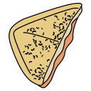

# Jaffle

**J**ust **a**nother **f**lat **f**ile **l**ivecoding **e**nvironment.

<p style="text-align: center;">

</p>

## Introduction

Jaffle is a yaml-based syntax for [Tidal-cycles](https://tidalcycles.org/), based on [Strudel](https://strudel.tidalcycles.org).

It is used to write tunes in yaml instead of JavaScript or Haskel, resulting in a lighter syntax. Its purpose is to make algorithmic music more accessible for people who are not familiar with programming languages.

Under the hood, Jaffle is a transpiler generating JavaScript code, which is then interpreted by Strudel.

## Syntax

This chapter aims to provide an overview of the Jaffle syntax, for people already familiar with Strudel. If necessary, read the [Strudel documentation](https://strudel.tidalcycles.org/learn).

### Comments

Yaml comments starts with a `#`:

<table style="width: 100%">
<td>Strudel</td><td>Jaffle</td>
<tr><td>

```js
// I'm a comment
```
</td><td>

```yml
# I'm a comment
```
</td></tr>
</table>

### Quotes

Most of the time, quotes are optional (although many yaml syntax highlighters sucks are render them correctly):

<table style="width: 100%">
<td>Strudel</td><td>Jaffle</td>
<tr><td>

```js
note("c@3 eb")
```
</td><td>

```yml
Note: c@3 eb
```
</td></tr>
</table>

But be careful, some mini-notations could me misinterpreted by the yaml parser, for instance when starting the notation with `[` (used to define arrays):

```yml
Sound: hh*8
    gain: [.25 1]*2 # not working
```

To address this, you can use simple or double quotes, or prepend the mini-notation with the `/` character, which is ignored:

```yml
- S: '~ sd ~'
- S: "tb*2 cb*2 ~"
- S: /bd ~ hh*2
```

### Function chaining

The chained functions are on the same indentation level:

<table style="width: 100%">
<td>Strudel</td><td>Jaffle</td>
<tr><td>

```js
note("c@3 eb")
  .lpf(600)
  .delay(.5)
  .gain(2)
```
</td><td>

```yml
Note: c@3 eb
lpf: 600
delay: .5
gain: 2
```
</td></tr>
</table>

Also, because dictionnaries are not ordered, the first instruction is capitalized (here `Note` instead `note`).

### Functions without parameters

It's totally safe to have a yaml attribute without value (just don't forget the `:`):

<table style="width: 100%">
<td>Strudel</td><td>Jaffle</td>
<tr><td>

```js
note("c@3 eb")
  .piano()
  .log()
```
</td><td>

```yml

Note: c@3 eb
piano:
log:
```
</td></tr>
</table>

### Functions with multiple parameters

Use yaml arrays:

<table style="width: 100%">
<td>Strudel</td><td>Jaffle</td>
<tr><td>

```js
stack(
  s("oh*2 cb*2 ~"),
  s("bd sd hh*2")
)
```
</td><td>

```yml
Stack:
- S: oh*2 cb*2 ~
- S: bd sd hh*2
```
</td></tr>
</table>

You could eventually use an inline array:

```yml
Stack: [ S: oh*2 cb*2 ~, S: bd sd hh*2 ]
```

If the root node is an array, the surrounding function is `Stack` by default. The code above can also be written like this:

```yml
- S: oh*2 cb*2 ~
- S: bd sd hh*2
```

### Mini-notation

When applying functions directly to a mini-notation, the `M` keyword must be used:

<table style="width: 100%">
<td>Strudel</td><td>Jaffle</td>
<tr><td>

```js
"c3 [eb3,g3]"
  .note()
```
</td><td>

```yml
M: c3 [eb3,g3]
note:
```
</td></tr>
</table>

### Escaping mini-notation

While Strudel distinguish mini-notations and strings by using simple or double quotes, Jaffle analyses strings as mini-notations by default. You must prepend them by the `:` sign to avoid this behavior.

<table style="width: 100%">
<td>Strudel</td><td>Jaffle</td>
<tr><td>

```js
n("1 2 3")
  .scale('C minor')
```
</td><td>

```yml
N: 1 2 3
scale: :C minor
```
</td></tr>
</table>

### Data serialization

To pass a dictionnary as a function parameter, you must append the `^` sign to the attribute name.

<table style="width: 100%">
<td>Strudel</td><td>Jaffle</td>
<tr><td>

```js
s("sd oh*2 hh")
  .pianoroll({ fold: 1 })
```
</td><td>

```yml
S: sd oh*2 hh
pianoroll^: { fold: 1 }
```
</td></tr>
</table>

You may want to pass a dictionnary on a specific argument, by adding its index next to `^`, starting from 1.

<table style="width: 100%">
<td>Strudel</td><td>Jaffle</td>
<tr><td>

```js
samples({
  bd: '...',
  sd: '...',
  hh: '...' }
  , '...')
```
</td><td>

```yml
samples^1:
- bd: ...
  sd: ...
  hh: ...
- ...
```
</td></tr>
</table>

Note: the `sample` example above does not work as is, see below.

### Out of scope functions

Some functions like `samples` are not part of the main music structure like `Stack` or `Cat`. You must prepend their name with the `.` sign:

<table style="width: 100%">
<td>Strudel</td>
<tr><td>

```js
samples({
  bd: ['bd/BT0AADA.wav','bd/BT0AAD0.wav'],
  sd: ['sd/rytm-01-classic.wav','sd/rytm-00-hard.wav'],
  hh: ['hh27/000_hh27closedhh.wav','hh/000_hh3closedhh.wav'],
}, 'github:tidalcycles/Dirt-Samples/master/');
s("<bd:0 bd:1>,~ <sd:0 sd:1>,[hh:0 hh:1]*2")
```
</td></tr>
</table>

<table style="width: 100%">
<td>Jaffle</td>
<tr><td>

```yml
.samples^1:
- bd: [ bd/BT0AADA.wav, bd/BT0AAD0.wav ]
  sd: [ sd/rytm-01-classic.wav, sd/rytm-00-hard.wav ]
  hh: [ hh27/000_hh27closedhh.wav, hh/000_hh3closedhh.wav ]
- :github:tidalcycles/Dirt-Samples/master/
S: <bd:0 bd:1>,~ <sd:0 sd:1>,[hh:0 hh:1]*2
```
</td></tr>
</table>

Not the both use of the prefix `.` and the suffix `^1` to serialize the first parameter.

You can add an extra `.` to `await` functions:
<table style="width: 100%">
<td>Strudel</td><td>Jaffle</td>
<tr><td>

```js
await samples({
  bd: '...',
  sd: '...',
  hh: '...' }
  , '...')
```
</td><td>

```yml
..samples^1:
- bd: ...
  sd: ...
  hh: ...
- ...
```
</td></tr>
</table>

### Signals

Signals are written like they was functions:

<table style="width: 100%">
<td>Strudel</td><td>Jaffle</td>
<tr><td>

```js
saw
  .range(50, 80)
  .segment(24)
  .note()
```
</td><td>

```yml
Saw:
range: [50, 80]
segment: 24
note:
```
</td></tr>
</table>

Note the clever use of the inline array in the `range` function to avoid line returns.

### Expressions

If you want to put an expression in a parameter, prepend it by the `=` sign:

<table style="width: 100%">
<td>Strudel</td><td>Jaffle</td>
<tr><td>

```js
"c3 [eb3,g3]"
  .add(1/3)
  .note()
```
</td><td>

```yml
M: c3 [eb3,g3]
add: =1/3
note:
```
</td></tr>
</table>

Such expressions are limited to simple mathematics (`+`, `=`, `*`, `/`).

### Function in parameter

Use the `Set` keyword to pass a function as parameter, such as in accumulation modifiers (here with an inline dictionnary):

<table style="width: 100%">
<td>Strudel</td><td>Jaffle</td>
<tr><td>

```js
note("c3 eb3 g3 a3")
  .sometimes(x=>x.gain(8))
```
</td><td>

```yml
Note: c3 eb3 g3 a3
sometimes: { Set: , gain: 8 }
```
</td></tr>
</table>

If necessary, the number of additional parameters must be passed to the `Set` value:

<table style="width: 100%">
<td>Strudel</td>
<tr><td>

```js
"<0 [2 4]>"
  .echoWith(4, 1/8, (p,n) => p.add(n*2))
  .scale('C minor')
  .note()
```
</td></tr>
</table>

<table style="width: 100%">
<td>Jaffle</td>
<tr><td>

```yml
M: <0 [2 4]>
echoWith: [ 4, =1/8, { Set: 1, add: =a*2 } ]
scale: C minor
note:
```
</td></tr>
</table>

Such parameters are named `a`, then `b`, then `c`.

## Contributing

See the [contribution guide](./CONTRIBUTING.md)!

## Authorship

### Jaffle transpiler and demo website

- credits: Nathanaël Jourdane and contributors
- license: [AGPL-3.0](./LICENSE)
- source: https://framagit.org/roipoussiere/jaffle

### Strudel engine

- credits: Strudel contributors
- license: [AGPL-3.0](https://www.gnu.org/licenses/agpl-3.0.txt)
- source: https://github.com/tidalcycles/strudel

### Pre-loaded sounds

- piano:
  - credits: Alexander Holm
  - license: [CC-by](http://creativecommons.org/licenses/by/3.0)
  - source: https://archive.org/details/SalamanderGrandPianoV3
- VCSL:
  - credits: Versilian Studios LLC
  - license: [CC0](https://creativecommons.org/publicdomain/zero/1.0/)
  - source: https://github.com/sgossner/VCSL
- Tidal drum machines:
  - source: https://github.com/ritchse/tidal-drum-machines
- EmuSP12:
  - source: https://github.com/tidalcycles/Dirt-Samples
